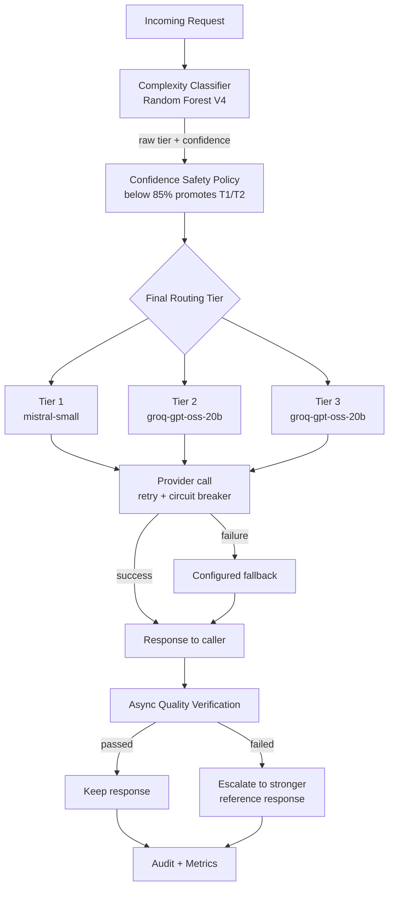

# ⚡ LLM Cost Autopilot

**Production-oriented, cost-aware LLM routing with confidence-aware tier promotion, provider fallback, quality verification, escalation, audit logging, and observability.**

LLM Cost Autopilot is an intelligent routing layer that sits in front of multiple LLM providers. It classifies each request by complexity, routes it to an appropriate cost/quality tier, verifies lower-cost responses when required, and escalates when quality is insufficient.

> **Core principle:** Use the least expensive model that is likely to satisfy the request, while maintaining explicit safety, quality, failure, and accounting paths.

---

## ✨ Key Features

- **Confidence-aware routing** — a Random Forest complexity classifier plus a safety policy that promotes low-confidence predictions one tier
- **Provider-agnostic registry** — models share one normalized response interface and a common set of failure categories
- **Retry, circuit breaker, and fallback** — bounded backoff, circuit opening after repeated failures, and a configured fallback model
- **Async quality verification** — cheap responses are checked against a stronger reference model; failures escalate
- **Full audit and cost accounting** — every request gets an ID and a SQLite audit record; raw prompts are never stored, only a hash
- **OpenAI-style FastAPI service** — every response carries routing metadata (tier, confidence, model, fallback, cost, latency)
- **Streamlit Command Center** — request playground, routing, provider health, cost, verification, and audit views; runs locally or in-process on Streamlit Cloud
- **Reproducible evaluation** — deterministic 30-request benchmark, frozen V4 baseline, and a 135-test regression suite

---

## 📊 Validation Snapshot

| Gate | Result |
|---|---|
| Automated regression | 135 passed |
| Deterministic benchmark | 100% routing accuracy |
| Benchmark success / fallback rate | 100% / 0% |
| Average benchmark latency | 0.9333 s |
| Benchmark P95 / P99 | 1.3500 s |
| Benchmark actual cost | $0.001425 |
| Estimated reduction vs configured all-GPT-4o baseline | 96.53% |
| Live confidence-promotion smoke test | Passed |
| Live provider-fallback smoke test | Passed |
| SQLite audit reconstruction | Passed |
| Streamlit direct-mode smoke test | Passed |

> The 96.53% figure is an estimated comparison against the project's configured all-GPT-4o pricing baseline. It is not a claim of universal production savings.

---

## 🏗️ Architecture



1. **Classify** — the V4 classifier predicts a complexity tier and a confidence
2. **Apply safety policy** — below 85% confidence, Tier 1 and Tier 2 predictions are promoted one tier
3. **Route** — the final tier selects the model
4. **Call provider** — bounded retries and a circuit breaker protect the call; failures go to the configured fallback
5. **Respond** — the caller gets the response with routing metadata
6. **Verify** — a stronger reference model checks the response asynchronously, and failures escalate
7. **Record** — the audit database and metrics capture the whole decision path

**Current routing configuration**

| Tier | Model | Provider |
|---|---|---|
| Tier 1 | `mistral-small` | Mistral |
| Tier 2 | `groq-gpt-oss-20b` | Groq |
| Tier 3 | `groq-gpt-oss-20b` | Groq |

Tier 3 is kept as the highest complexity tier in the routing policy. In the current deployment, Tier 2 and Tier 3 map to the same Groq model rather than separate live providers. GPT-4o pricing is retained only as a baseline for cost comparisons; it is not a live routing target.

---

## 🧩 Tech Stack

| Layer | Tool |
|---|---|
| Complexity classifier | Random Forest (V4, frozen `joblib` artifact) |
| LLM providers | Mistral (Tier 1), Groq GPT-OSS 20B (Tier 2 / 3 and fallback) |
| API | FastAPI |
| Dashboard | Streamlit |
| Audit database | SQLite |
| Environment / runner | uv |
| Testing | pytest + deterministic mocked benchmark |

---

## 📂 Project Structure

```
llm-cost-autopilot/
├── benchmark/
│   ├── benchmark.py
│   └── results/
│       ├── latest.json          # current deterministic benchmark
│       └── v4_final.json        # frozen V4 evaluation
├── config/
│   └── routing.yaml
├── dashboard/
│   └── app.py                   # Streamlit Command Center
├── data/
│   ├── classifier_v4_final.joblib
│   ├── labeled_dataset_v4.csv
│   └── ...
├── scripts/
├── src/
│   ├── api/
│   ├── classifier/
│   ├── models/
│   ├── providers/
│   ├── verification/
│   ├── routing.py
│   ├── logging_db.py
│   └── config.py
├── tests/
├── requirements.txt
└── pyproject.toml
```

Runtime secrets, local environments, databases, logs, and other generated artifacts are excluded from Git.

---

## 🚀 Quick Start

```bash
# Run the regression suite
uv run pytest -q

# Run offline routing validation
uv run python -m scripts.check_routing_offline

# Run the deterministic benchmark
uv run python -m benchmark.benchmark

# Start the API
uv run uvicorn src.api.main:app --reload

# Start the dashboard
uv run streamlit run dashboard/app.py
```

Run the benchmark with `python -m benchmark.benchmark`, not `python benchmark/benchmark.py`. The benchmark imports the repository's `src` package, so only the module form works. Results are written to `benchmark/results/latest.json`.

The API serves interactive documentation at `/docs` when it is running.

---

## 🎯 Confidence-Aware Routing

The classifier produces a predicted complexity tier, a confidence score, and a probability distribution. A separate safety policy then decides the final tier:

```
confidence >= 85%  →  keep the predicted tier
confidence <  85%  →  promote T1/T2 by one tier
T3                 →  stays T3
```

**Example:** the classifier predicts Tier 1 at 80.5% confidence, the safety policy flags it as low confidence, and the final routing is Tier 2. The API response and the audit database expose both decisions.

**V4 classifier**
- 335 labeled examples (Tier 1: 121, Tier 2: 106, Tier 3: 108) and 19 structural features
- Frozen artifact at `data/classifier_v4_final.joblib`, loaded directly by the service. It is never retrained at startup or during requests.
- About 97% accuracy on the held-out evaluation. The independent routing benchmark is kept separate from the training and held-out data.

---

## 🔁 Reliability: Retry, Circuit Breaker, Fallback

Provider failures are normalized into categories: rate limit, timeout, authentication, server error, network/provider failure, and circuit open. Routing and accounting logic stay independent of any provider SDK.

When a provider call fails, the system:
1. Retries transient failures with bounded backoff
2. Opens a circuit after repeated failures
3. Routes to the configured fallback
4. Records the primary failure and the fallback decision
5. Returns a standardized response

The audit trail separates the model selected as primary from the model that actually served the request.

**Verified live fallback path** — a Streamlit smoke test hit the real fallback:

```
Primary:          mistral-small  →  rate_limit
Fallback:         groq-gpt-oss-20b  →  successful response (quality score 1.0)
Audit record:     primary_error_type = rate_limit, used_fallback = 1, verified = 1
```

---

## ✅ Quality Verification

Lower-cost responses can be verified against a stronger reference model:

```
Cheap response → Quality verification → Pass: keep
                                      → Fail: escalate to reference response
```

Each verification records the task type, quality score, threshold, original and reference models, pass/fail result, escalation status, quality gap, extra cost, and latency. Verification runs asynchronously, so the normal routing path doesn't wait for the audit. Tier 3 requests skip automatic verification because they already use the highest configured tier.

---

## 🧾 Audit & Cost Accounting

Every routed request gets a request ID and a SQLite audit record covering the classifier tier, final tier, confidence, selected and primary models, provider error type, token usage, cost, latency, verification and escalation status, and quality information. Raw prompts are not stored.

This makes it possible to answer questions like:
- How often is the classifier uncertain, and how often does that cause promotion?
- Which provider is failing, and how often does fallback occur?
- How much does verification cost?
- How much would the configured GPT-4o baseline have cost?
- Which tiers receive the most traffic?

---

## 🌐 API

| Method | Endpoint | Purpose |
|---|---|---|
| GET | `/healthz` | Liveness |
| GET | `/readyz` | Dependency / readiness checks |
| POST | `/v1/completions` | Route and complete a request |
| GET | `/v1/models` | List available models |
| GET | `/v1/stats` | Routing and cost statistics |
| PUT | `/v1/routing-config` | Update routing configuration |

A completion returns routing metadata alongside the generated text, so every decision is explainable and auditable. The values below are illustrative:

```json
{
  "id": "request-id",
  "choices": [{ "message": { "role": "assistant", "content": "..." } }],
  "routing": {
    "tier": 2,
    "classifier_tier": 1,
    "classification_confidence": 0.62,
    "low_confidence": true,
    "selected_model": "groq-gpt-oss-20b",
    "reasoning": "classified as simple - routed to the cheapest model (low-confidence classifier prediction was promoted to a safer routing tier)",
    "used_fallback": false,
    "cost_usd": 0.00005,
    "latency_s": 0.91,
    "verification": "queued"
  }
}
```

---

## 🖥️ Dashboard & Deployment

The Streamlit Command Center includes a request playground; views of the raw classifier tier, confidence, safety policy, final tier, and promotions; model distribution; provider health; fallback statistics; cost trends; verification and escalation metrics; benchmark results; and audit records.

**Streamlit Cloud direct mode** runs the routing engine in-process instead of requiring a separately hosted FastAPI server. Enable it with `AUTOPILOT_CLOUD_MODE=true` and supply credentials through Streamlit's secrets configuration, never through Git:

```
AUTOPILOT_CLOUD_MODE=true
MISTRAL_API_KEY=...
GROQ_API_KEY=...
GROQ_MODEL=openai/gpt-oss-20b
```

**Limitation:** the audit database is SQLite, and Streamlit Cloud's local filesystem is not durable production storage. Cloud can demonstrate the routing system and its observability layer, but durable multi-instance analytics would need an external persistent database.

---

## 📈 Benchmarking & Validation

The deterministic benchmark uses 30 fixed requests with mocked provider responses, so it is reproducible and needs no live provider calls.

| Metric | Result |
|---|---|
| Requests | 30 |
| Routing accuracy | 100.00% |
| Success / fallback rate | 100.00% / 0.00% |
| Average latency | 0.9333 s |
| P50 / P95 / P99 latency | 0.9000 s / 1.3500 s / 1.3500 s |
| Input / output / total tokens | 2,250 / 3,550 / 5,800 |
| Actual cost (average per request) | $0.001425 ($0.0000475) |
| Configured all-GPT-4o baseline | $0.041125 |
| Estimated cost reduction | $0.039700 (96.53%) |

**Frozen V4 baseline** (`benchmark/results/v4_final.json`): 30-request independent benchmark, 93.33% routing accuracy, 100% success, 0% fallback.

The 93.33% figure is the historical frozen V4 evaluation. The 100% figure is the current deterministic benchmark, run after later routing-policy and implementation work. They are different measurements and should not be presented as the same one.

**Local validation sequence** — all passed: `/healthz`, `/readyz`, authenticated `/v1/models`, authenticated `/v1/completions`, confidence promotion, SQLite request audit, `/v1/stats` aggregation, deterministic benchmark, Streamlit direct mode, live fallback path, and the full regression suite (135 passed, plus 1 warning that comes from the Starlette/AnyIO dependency stack, not application code).

**Verified live confidence-promotion path**

```
Classifier tier: 1  →  Confidence: 80.5%  →  Low confidence: true
Final tier: 2  →  Model: groq-gpt-oss-20b  →  Fallback: false
```

The SQLite audit record confirmed the same routing transition.

---

## 🧭 Design Principles

- **Cost-aware, not cost-only** — the cheapest model isn't always the right one, so routing combines classification, confidence-aware promotion, and post-response verification
- **ML decision ≠ production decision** — the classifier predicts; a separate safety policy can overrule it when confidence is low
- **Failures are first-class events** — provider failures, retries, circuit states, fallbacks, verification failures, and escalations are recorded, not hidden
- **Reproducibility over impressive-looking numbers** — held-out evaluation, the independent benchmark, frozen V4 results, current benchmark results, and live smoke tests are kept as separate measurements
- **Explainability at the API boundary** — callers see the raw tier, confidence, final tier, promotion, model, fallback, cost, latency, and verification status, not just the generated text
