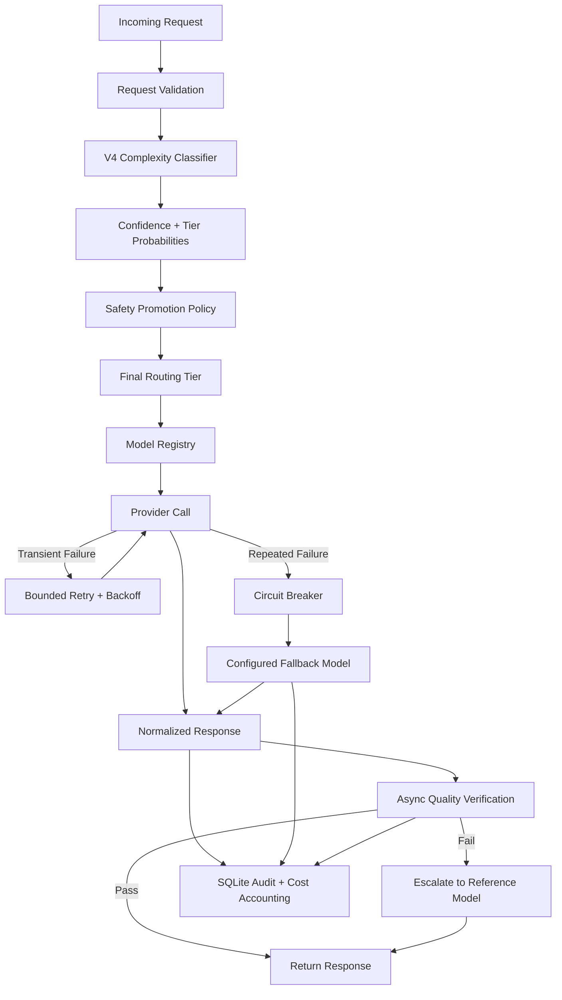

<div align="center">

# ⚡ LLM Cost Autopilot

### Production-Oriented, Cost-Aware LLM Routing

**Route every request to the least expensive model likely to satisfy it—without sacrificing quality, reliability, safety, or observability.**

[](https://www.python.org/)
[](https://fastapi.tiangolo.com/)
[](https://streamlit.io/)
[](https://scikit-learn.org/)
[](#-benchmarking--validation)
[](LICENSE)

</div>

---

## 📌 Overview

**LLM Cost Autopilot** is an intelligent routing layer that sits in front of multiple LLM providers.

It classifies each request by complexity, routes it to an appropriate cost-and-quality tier, promotes uncertain predictions to a safer tier, verifies lower-cost responses when needed, and escalates to a stronger reference model when quality is insufficient.

> **Use the least expensive model that is likely to satisfy the request, while maintaining explicit safety, quality, failure, and accounting paths.**

It is not simply a model proxy. Every request produces an explainable routing decision, a measurable cost record, provider-failure handling, and an auditable execution trail.

---

## ✨ Key Capabilities

### 🧠 Confidence-Aware Routing

- Random Forest V4 classifier predicts request complexity, confidence, and tier probabilities.
- Low-confidence Tier 1 and Tier 2 predictions are promoted one tier by a separate safety policy.
- Frozen ML artifact ensures deterministic startup and request-time behavior.
- API responses expose the raw prediction, confidence, final tier, promotion decision, model, fallback status, cost, and latency.

### 🔁 Provider Reliability

- Provider-agnostic model registry with normalized responses and shared failure categories.
- Bounded retries with backoff for transient provider failures.
- Circuit breaker opens after repeated failures to prevent cascading calls.
- Configured fallback routing when the primary provider fails.
- Audit records distinguish the primary selected model from the model that actually served the request.

### ✅ Quality Verification

- Lower-cost responses are asynchronously verified against a stronger reference model.
- Verification records quality score, threshold, quality gap, escalation status, additional cost, and latency.
- Failed verification escalates to the reference-model response.
- Tier 3 requests skip automatic verification because they already use the highest configured tier.

### 🧾 Auditability & Cost Control

- SQLite audit database records the complete routing and verification path.
- Raw prompts are never stored; only hashes are retained.
- Token, latency, and cost accounting are captured for every request.
- Dashboards expose confidence promotions, fallback frequency, provider failures, verification cost, tier traffic, and baseline-cost comparison.

### 📡 Production Interface

- OpenAI-style FastAPI service with health, readiness, completion, model, statistics, and routing-configuration endpoints.
- Streamlit Command Center for request experimentation, routing inspection, provider health, cost trends, verification results, and audit exploration.
- Streamlit Cloud direct mode can run the routing engine in-process without a separately hosted API.

---

## 📊 Validation Snapshot

| Validation Gate | Result |
|---|---:|
| Automated regression suite | **139 passed** |
| Deterministic benchmark routing accuracy | **100%** |
| Benchmark success rate | **100%** |
| Benchmark fallback rate | **0%** |
| Average benchmark latency | **0.9333 s** |
| Benchmark P95 / P99 latency | **1.3500 s** |
| Benchmark actual cost | **$0.001425** |
| Estimated reduction vs configured all-GPT-4o baseline | **96.53%** |
| Live confidence-promotion smoke test | **Passed** |
| Live provider-fallback smoke test | **Passed** |
| SQLite audit reconstruction | **Passed** |
| Streamlit direct-mode smoke test | **Passed** |

> The **96.53%** figure is an estimated comparison against this project’s configured all-GPT-4o pricing baseline. It is not a claim of universal production savings.

### Historical V4 Baseline

| Metric | Frozen V4 Result |
|---|---:|
| Independent benchmark requests | 30 |
| Routing accuracy | **93.33%** |
| Success rate | **100%** |
| Fallback rate | **0%** |

The **93.33%** result is the historical frozen V4 evaluation. The current **100%** result comes from the later deterministic benchmark after routing-policy and implementation improvements. These are separate measurements and are intentionally not merged.

---

## 🏗️ Architecture



### Request Flow

1. **Classify** — predict complexity tier, confidence, and probability distribution.
2. **Apply safety policy** — promote uncertain Tier 1/Tier 2 predictions by one tier.
3. **Route** — select the configured model for the final tier.
4. **Call provider** — apply retries and circuit-breaker protection.
5. **Fallback** — route repeated or non-recoverable failures to the fallback model.
6. **Respond** — return generated text with complete routing metadata.
7. **Verify** — asynchronously check eligible lower-cost responses.
8. **Escalate** — replace insufficient responses with the reference-model response.
9. **Record** — persist routing, verification, cost, and reliability metadata.

---

## 🎯 Confidence-Aware Routing

The classifier does not make the final production decision by itself. A separate safety policy can overrule uncertain predictions.

```text
confidence >= 85%  →  keep predicted tier
confidence <  85%  →  promote Tier 1 / Tier 2 by one tier
Tier 3             →  remains Tier 3
```

### Example

```text
Classifier prediction: Tier 1
Confidence:            80.5%
Low-confidence flag:   true
Final routing tier:    Tier 2
Selected model:        groq-gpt-oss-20b
Fallback:              false
```

Both the classifier prediction and the safety-policy decision are exposed through the API and stored in the audit database.

### V4 Classifier

| Attribute | Value |
|---|---:|
| Algorithm | Random Forest |
| Artifact | `data/classifier_v4_final.joblib` |
| Labeled examples | 335 |
| Tier 1 / 2 / 3 examples | 121 / 106 / 108 |
| Structural features | 19 |
| Held-out evaluation accuracy | ~97% |

The artifact is frozen and loaded directly by the service. It is not retrained at startup or during request handling.

---

## 🔁 Reliability

Provider failures are normalized into shared categories:

- Rate limit
- Timeout
- Authentication failure
- Server error
- Network or provider failure
- Circuit open

On failure, the system retries transient errors with bounded backoff, opens the circuit after repeated failures, routes to the configured fallback, and records both the primary failure and fallback decision.

### Verified Live Fallback Path

```text
Primary model:     mistral-small
Failure type:      rate_limit
Fallback model:    groq-gpt-oss-20b
Fallback result:   successful response
Quality score:     1.0

Audit record:
primary_error_type = rate_limit
used_fallback      = 1
verified           = 1
```

---

## ✅ Quality Verification

```text
Cheap response → Quality verification → Pass: keep response
                                      → Fail: escalate to reference response
```

Each verification records:

- Task type
- Quality score and threshold
- Original and reference models
- Pass/fail and escalation status
- Quality gap
- Additional verification cost
- Verification latency

Verification runs asynchronously, so the main routing path does not wait for the audit or verification result.

---

## 🧾 Audit & Cost Accounting

Every routed request receives a request ID and a SQLite audit record containing:

- Classifier and final routing tiers
- Classification confidence and promotion decision
- Selected primary model and actually served model
- Provider error type and fallback status
- Token usage, cost, and latency
- Verification and escalation status
- Quality information

Raw prompts are never stored; only hashes are retained.

This makes it possible to answer:

- How often is the classifier uncertain, and how often does that cause promotion?
- Which provider is failing, and how often does fallback occur?
- How much does verification cost?
- How much would the configured GPT-4o baseline have cost?
- Which routing tiers receive the most traffic?
- Which requests required escalation?

---

## 🌐 API

| Method | Endpoint | Purpose |
|---|---|---|
| `GET` | `/healthz` | Liveness check |
| `GET` | `/readyz` | Dependency and readiness checks |
| `POST` | `/v1/completions` | Route and complete a request |
| `GET` | `/v1/models` | List available models |
| `GET` | `/v1/stats` | Routing, verification, and cost statistics |
| `PUT` | `/v1/routing-config` | Update routing configuration |

### Example Completion Response

```json
{
  "id": "request-id",
  "choices": [
    {
      "message": {
        "role": "assistant",
        "content": "..."
      }
    }
  ],
  "routing": {
    "tier": 2,
    "classifier_tier": 1,
    "classification_confidence": 0.62,
    "low_confidence": true,
    "selected_model": "groq-gpt-oss-20b",
    "reasoning": "Classified as simple and routed to the cheapest model. Low-confidence classifier prediction was promoted to a safer routing tier.",
    "used_fallback": false,
    "cost_usd": 0.00005,
    "latency_s": 0.91,
    "verification": "queued"
  }
}
```

---

## 🧩 Tech Stack

| Layer | Tool |
|---|---|
| Complexity classifier | Random Forest V4, frozen Joblib artifact |
| LLM providers | Mistral, Groq GPT-OSS 20B |
| API | FastAPI |
| Dashboard | Streamlit |
| Audit database | SQLite |
| Configuration | YAML-based routing configuration |
| Package management | uv |
| Testing | pytest with deterministic mocked benchmark |

### Current Routing Configuration

| Tier | Model | Provider |
|---|---|---|
| Tier 1 | `mistral-small` | Mistral |
| Tier 2 | `groq-gpt-oss-20b` | Groq |
| Tier 3 | `groq-gpt-oss-20b` | Groq |

Tier 3 remains the highest complexity tier. In the current deployment, Tier 2 and Tier 3 map to the same Groq model rather than separate live providers. GPT-4o pricing is retained only as a comparison baseline; it is not a live routing target.

---

## 📂 Project Structure

```text
llm-cost-autopilot/
├── benchmark/
│   ├── benchmark.py
│   └── results/
│       ├── latest.json
│       └── v4_final.json
├── config/
│   └── routing.yaml
├── dashboard/
│   └── app.py
├── data/
│   ├── classifier_v4_final.joblib
│   ├── labeled_dataset_v4.csv
│   └── ...
├── scripts/
├── src/
│   ├── api/
│   ├── classifier/
│   ├── models/
│   ├── providers/
│   ├── verification/
│   ├── routing.py
│   ├── logging_db.py
│   └── config.py
├── tests/
├── requirements.txt
└── pyproject.toml
```

Runtime secrets, local environments, databases, logs, and generated artifacts are excluded from Git.

---

## 🚀 Quick Start

### 1. Clone and install

```bash
git clone [https://github.com/rj1230/llm-cost-autopilot.git](https://github.com/rj1230/llm-cost-autopilot.git)
cd llm-cost-autopilot
uv sync
```

Or with pip:

```bash
pip install -r requirements.txt
```

### 2. Configure environment variables

Create a `.env` file:

```env
MISTRAL_API_KEY=your_mistral_api_key
GROQ_API_KEY=your_groq_api_key
GROQ_MODEL=openai/gpt-oss-20b
```

### 3. Run validation and benchmark

```bash
uv run pytest -q
uv run python -m scripts.check_routing_offline
uv run python -m benchmark.benchmark
```

> Run the benchmark as a module: `python -m benchmark.benchmark`. It imports the repository’s `src` package, so the module form is required.

Results are written to:

```text
benchmark/results/latest.json
```

### 4. Start the API

```bash
uv run uvicorn src.api.main:app --reload
```

Interactive documentation:

```text
http://127.0.0.1:8000/docs
```

### 5. Start the Streamlit Command Center

```bash
uv run streamlit run dashboard/app.py
```

---

## 🖥️ Streamlit Command Center

The dashboard provides:

- Request playground for testing prompts and routing decisions
- Classifier tier, confidence, and probability distribution
- Safety-policy promotion decisions
- Final routing tier and selected model
- Provider health and failure categories
- Fallback statistics
- Cost trends and baseline comparison
- Verification and escalation metrics
- Benchmark results
- SQLite audit records

### Streamlit Cloud Direct Mode

Streamlit Cloud can run the routing engine in-process instead of requiring a separately hosted FastAPI server.

```env
AUTOPILOT_CLOUD_MODE=true
MISTRAL_API_KEY=...
GROQ_API_KEY=...
GROQ_MODEL=openai/gpt-oss-20b
```

> **Limitation:** SQLite is not durable production storage on Streamlit Cloud because its local filesystem is ephemeral. Cloud mode is suitable for demonstrating routing and observability; durable multi-instance analytics require an external persistent database.

---

## 📈 Benchmarking & Validation

The deterministic benchmark uses **30 fixed requests** with mocked provider responses, making it reproducible and independent of live provider availability.

| Metric | Result |
|---|---:|
| Requests | 30 |
| Routing accuracy | **100.00%** |
| Success rate | **100.00%** |
| Fallback rate | **0.00%** |
| Average latency | **0.9333 s** |
| P50 / P95 / P99 latency | 0.9000 s / 1.3500 s / 1.3500 s |
| Input / output / total tokens | 2,250 / 3,550 / 5,800 |
| Actual cost | **$0.001425** |
| Average cost per request | **$0.0000475** |
| Configured all-GPT-4o baseline | **$0.041125** |
| Estimated cost reduction | **$0.039700 / 96.53%** |

### Local Validation Sequence

All of the following checks passed:

- `/healthz`
- `/readyz`
- Authenticated `/v1/models`
- Authenticated `/v1/completions`
- Confidence-promotion path
- SQLite request audit
- `/v1/stats` aggregation
- Deterministic benchmark
- Streamlit direct mode
- Live provider-fallback path
- Full regression suite: **139 passed**

The single warning originates from the Starlette/AnyIO dependency stack, not application code.

---

## 🧭 Design Principles

- **Cost-aware, not cost-only** — routing combines classification, confidence-aware promotion, and post-response verification.
- **ML decision is not the production decision** — a separate safety policy can overrule low-confidence predictions.
- **Failures are first-class events** — provider errors, retries, circuit states, fallbacks, verification failures, and escalations are recorded.
- **Reproducibility over impressive-looking numbers** — held-out evaluation, frozen V4 results, current benchmarks, and live smoke tests remain separate measurements.
- **Explainability at the API boundary** — callers see the complete routing decision, not only generated text.
- **Privacy by default** — raw prompts are never persisted; only hashes are stored.

---

## 📄 License

This project is licensed under the MIT License.
tHub: [@rj1230](https://github.com/rj1230)
